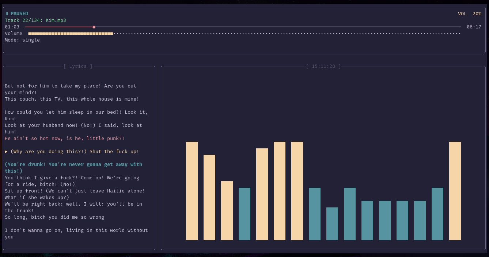

# Rose Pine theme for raymp

- rose-pine raymp plugin

<p align="center">
  
</p>

# Previews
| Main | Dawn | Moon |
| --- | --- | --- |
|  |  |  |

# Install
- copy the cloned in `.rmp/plugins` folder

# Configurations
```lua
{
    "rose-pine-rmp",
    -- config
    {
        VARIANT = "main" --"main" "dawn" "moon" 
    }
}
```
- disable theme from settings config
