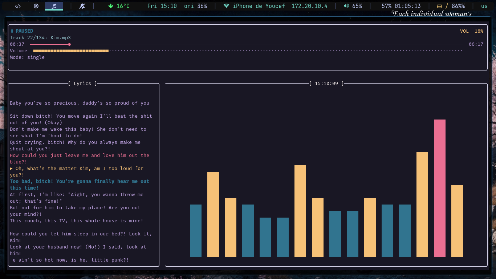
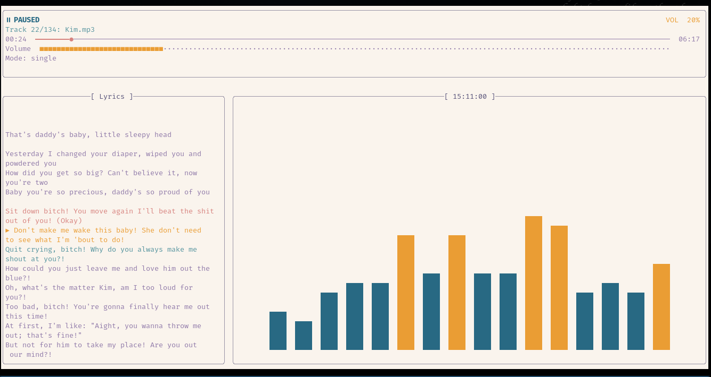
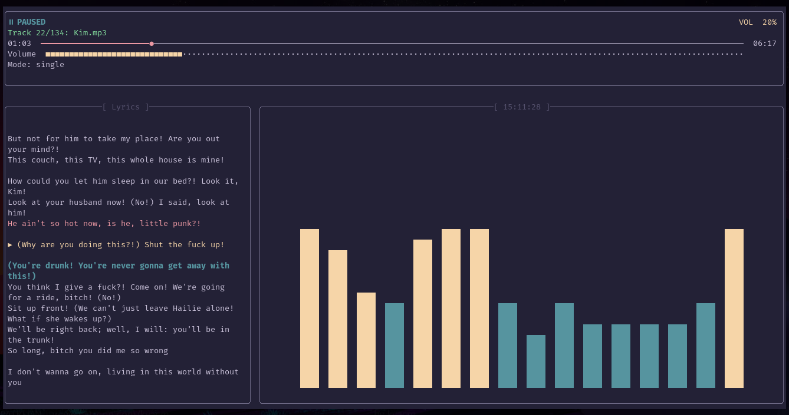

# Rose Pine theme for raymp

- rose-pine raymp plugin

<p align="center">
  
</p>

# Previews
| Main | Dawn | Moon |
| --- | --- | --- |
|  |  |  |

# Install
- copy the cloned in `.rmp/plugins` folder

# Configurations
```lua

local settings = raymp.engine.settings
settings.theme = "rose-pine"

-- NOTE: rose-pine plugin configuration
raymp:plug {
    priority = 0,
    name = "rose-pine-theme-rmp"
}
raymp.rose_pine_plugin = {}
raymp.rose_pine_plugin.variant = "main"
raymp.rose_pine_plugin.name_as = "rose-pine"
--------
```

- sins the plugin is activated u can choose the theme in **theme** field in settings configurations
